# Exploitation Report
## Cyber Vuln Shop — Flask E-Commerce Application

**Vulnerable build URL:** http://127.0.0.1:5001  
**Fixed build URL:** http://127.0.0.1:5000  
**Repository:** https://github.com/ammarmaqdoom/cyber-vuln-shop  
**Testing window:** May 2026  
**Total vulnerabilities discovered:** 10

This report documents every vulnerability that was first introduced in the intentionally vulnerable build (`demo/vulnerable_app.py`) and then remediated in the production code (`app.py`, `routes/`, `models.py`, `config.py`, and templates). Each finding follows the same structure: Description, Steps to Reproduce, Impact, Evidence, Payload, Remediation.

---

## Table of Contents

1. [Broken RBAC On Admin Pages](#vulnerability-1--broken-rbac-on-admin-pages)
2. [Missing CSRF Protection](#vulnerability-2--missing-csrf-protection)
3. [Open Redirect On Login `next`](#vulnerability-3--open-redirect-on-login-next)
4. [SQL Injection On Product Search](#vulnerability-4--sql-injection-on-product-search)
5. [Stored XSS In Product Reviews](#vulnerability-5--stored-xss-in-product-reviews)
6. [IDOR On Order Details](#vulnerability-6--idor-on-order-details)
7. [Debug Endpoint Leaks Secrets](#vulnerability-7--debug-endpoint-leaks-secrets)
8. [Unauthenticated User Dump With Weak Hashes](#vulnerability-8--unauthenticated-user-dump-with-weak-hashes)
9. [Unauthenticated Database Export](#vulnerability-9--unauthenticated-database-export)
10. [Weak Password Accepted](#vulnerability-10--weak-password-accepted)

---

## Vulnerability 1: Broken RBAC On Admin Pages

**Severity:** High  
**Category:** Broken Access Control  
**OWASP:** A01:2021 Broken Access Control

### Description

The admin dashboard, user list, product CRUD, and order management pages are intended for users whose `role` is `admin`. The vulnerable build only checks that the user is logged in. Any registered customer can therefore browse to `/admin` and read or modify privileged data.

### Steps to Reproduce

We logged in to the vulnerable build at `http://127.0.0.1:5001/auth/login` with the regular customer account `alice` / `Alice1234!`. After landing on the products page, we typed `http://127.0.0.1:5001/admin` directly into the address bar. The server returned the admin dashboard listing every user, their role, and an MD5 password hash, even though our role in the database was `user`.

### Impact

A regular customer immediately gains a full view of the user base, including the admin email address, and reaches the admin product and order management screens. From there, the attacker can change pricing, alter user roles, or read every order in the system, which is a full administrative compromise.

### Evidence

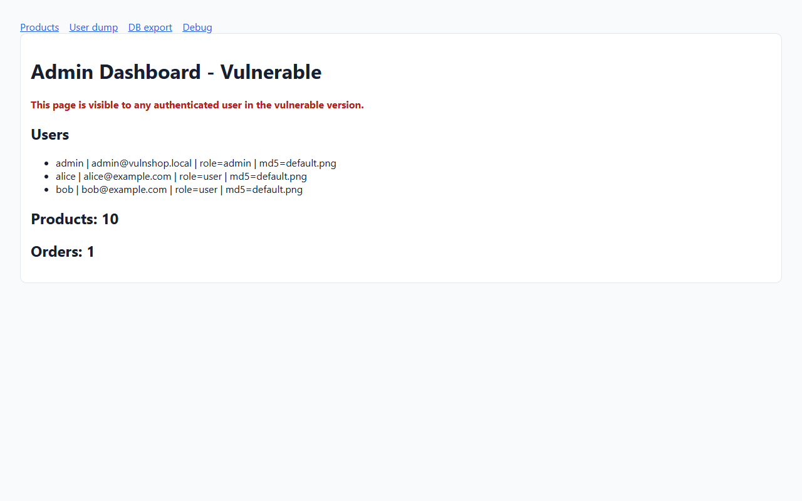
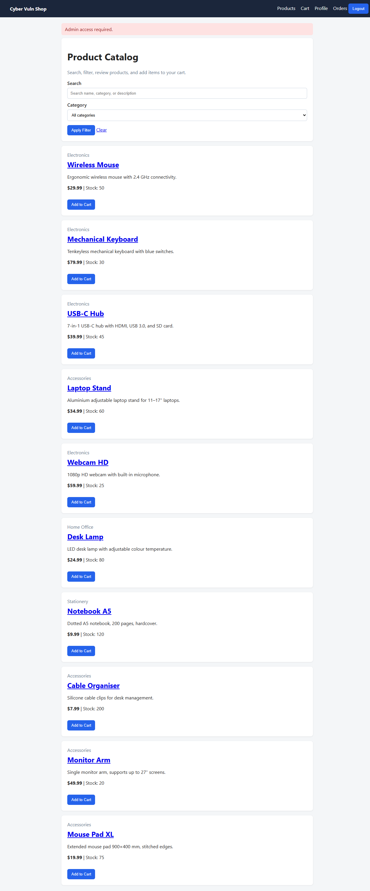
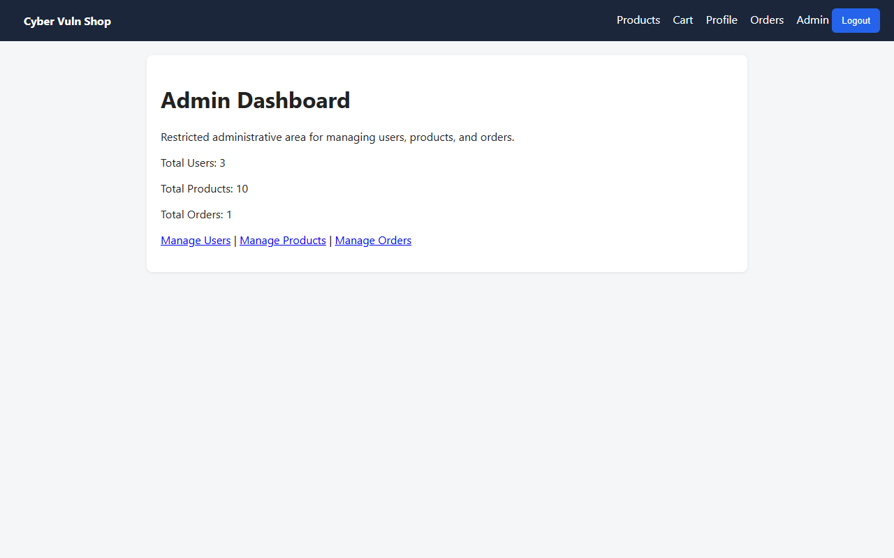

**Endpoint accessed:** `GET http://127.0.0.1:5001/admin`

### Payload

No payload required. The vulnerability is exploited purely through direct URL navigation while authenticated as a non-admin.

### Remediation

The production code in `routes/admin.py` now wraps every admin route with the `admin_required` decorator that checks `current_user.is_admin` (a property defined on the `User` model). When a non-admin user tries to access an admin route, the decorator flashes a warning and redirects them to the login page. The re-test screenshot confirms that `alice` is redirected away and that `admin` retains access.

---

## Vulnerability 2: Missing CSRF Protection

**Severity:** High  
**Category:** Broken Access Control / Session Riding  
**OWASP:** A01:2021 Broken Access Control

### Description

The vulnerable build does not enable Flask-WTF's `CSRFProtect` extension and does not include CSRF tokens in its forms. A logged-in user who visits a malicious page can have any state-changing action performed on their behalf because the browser silently sends their session cookie with the cross-site POST request.

### Steps to Reproduce

We logged in to the vulnerable build as `bob` and left the tab open. In another tab we opened `demo/csrf_attack_vulnerable.html`, a local HTML file that auto-submits a form to `http://127.0.0.1:5001/profile/update` with `username=csrf_owned_user` and `email=csrf-owned@example.com`. The browser attached our session cookie, the server accepted the POST, and `http://127.0.0.1:5001/profile` then showed the new attacker-controlled username and email.

### Impact

Any user who views a malicious page while authenticated can be silently taken over. Although our proof only changes the username and email, the same technique works for any state-changing endpoint: changing roles, deleting products, or placing orders. CSRF is on the OWASP Top 10 for this exact reason.

### Evidence

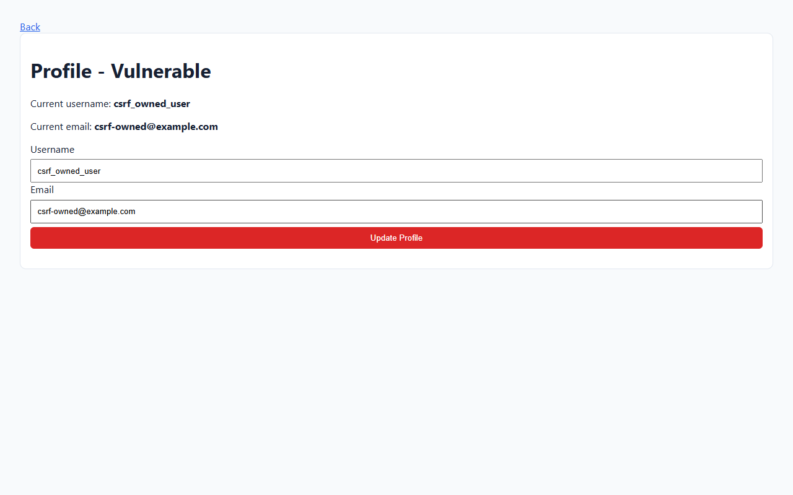
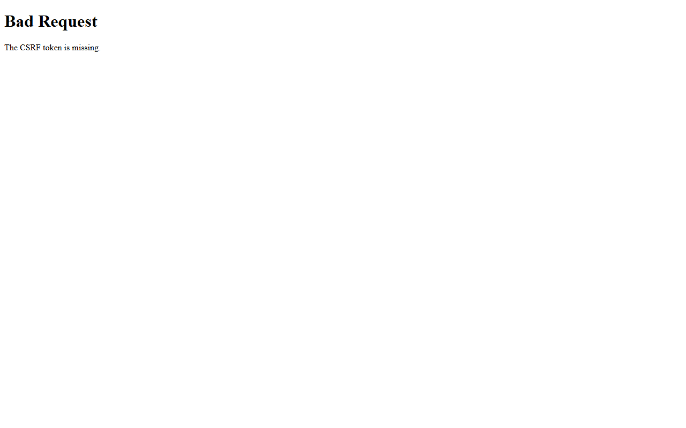

**Endpoint targeted:** `POST http://127.0.0.1:5001/profile/update`

### Payload

```html
<form id="csrf" method="post" action="http://127.0.0.1:5001/profile/update">
  <input type="hidden" name="username" value="csrf_owned_user">
  <input type="hidden" name="email" value="csrf-owned@example.com">
</form>
<script>document.getElementById('csrf').submit();</script>
```

### Remediation

The production app initialises `CSRFProtect` in `extensions.py` and binds it during `create_app` in `app.py`. Every POST form in `templates/` now includes `<input type="hidden" name="csrf_token" value="{{ csrf_token() }}">`. Re-running the same attack against `http://127.0.0.1:5000/profile/update` produces an HTTP 400 response with the "The CSRF token is missing" error.

---

## Vulnerability 3: Open Redirect On Login `next`

**Severity:** Medium  
**Category:** Broken Access Control / Phishing  
**OWASP:** A01:2021 Broken Access Control

### Description

The vulnerable login route honours any value of the `next` query parameter after a successful login. An attacker can craft a link that looks like the trusted login page yet ends up on a phishing or malware site once the user signs in.

### Steps to Reproduce

We opened `http://127.0.0.1:5001/auth/login?next=https://example.com/phishing` and logged in as `admin`. The server responded with `HTTP 302 Found` and the `Location` header pointed to `https://example.com/phishing`. The browser then loaded the external page immediately after the user authenticated.

### Impact

The application's own login URL becomes a redirector for phishing. Victims see a legitimate domain in their browser history before being silently sent to an attacker-controlled page, which makes credential phishing significantly more effective.

### Evidence

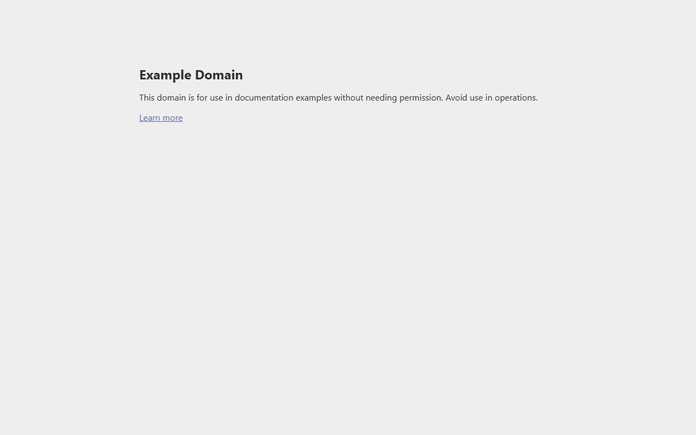
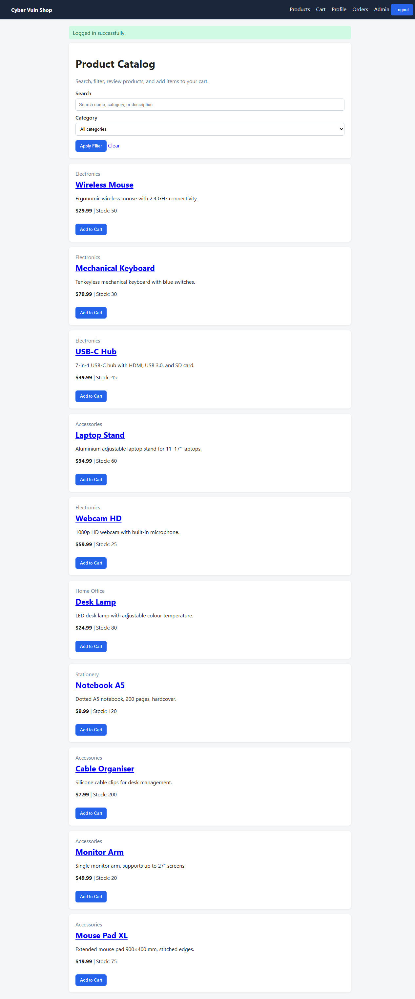

**Endpoint accessed:** `POST http://127.0.0.1:5001/auth/login?next=https://example.com/phishing`

### Payload

```
http://127.0.0.1:5001/auth/login?next=https://example.com/phishing
```

### Remediation

The production `routes/auth.py` defines `is_safe_redirect(target)` which validates that the target URL parses to the same host as the request. If the validation fails, the login route redirects to the local product catalog instead. Re-running the attack against the fixed build returns a redirect to `/products/`.

---

## Vulnerability 4: SQL Injection On Product Search

**Severity:** Critical  
**Category:** Injection  
**OWASP:** A03:2021 Injection

### Description

The vulnerable product search concatenates the `q` query parameter into a raw SQL statement. An attacker can inject a `UNION SELECT` to read any table that the application user has access to, including the `users` table containing email addresses and password hashes.

### Steps to Reproduce

While logged in as `alice`, we navigated to the URL `http://127.0.0.1:5001/products/?q=%25%27%20UNION%20SELECT%20id%2C%20email%2C%20%27%27%2C%200%2C%200%2C%20%27%27%2C%20%27%27%20FROM%20users--`. The page rendered email addresses such as `alice@example.com` and `admin@vulnshop.local` as product names, proving that the data from the `users` table was leaked through the products search results.

### Impact

Any visitor with login can dump entire tables, including credentials and order data. With a slightly more elaborate payload the attacker can also write data using `;UPDATE` statements, escalate privileges, or pivot into other databases hosted on the same engine.

### Evidence

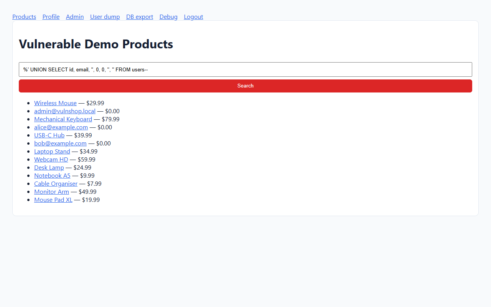
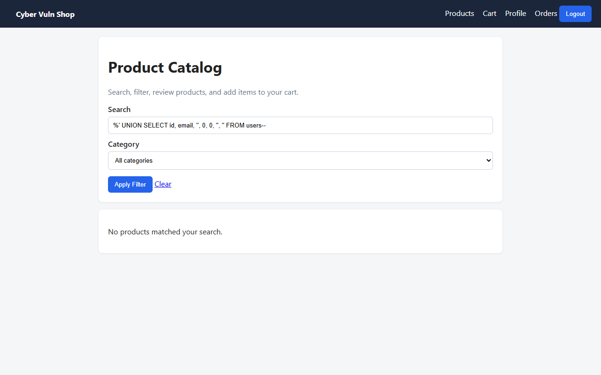

**Endpoint accessed:** `GET http://127.0.0.1:5001/products/?q=...`

### Payload

```
%' UNION SELECT id, email, '', 0, 0, '', '' FROM users--
```

### Remediation

The production `routes/products.py` uses SQLAlchemy ORM expressions (`Product.query.filter(Product.name.ilike(...))`) which parameterise the query. The same payload against `http://127.0.0.1:5000/products/?q=...` produces an empty result list because the parameter is treated as a literal string. The remediation also adds an explicit category filter and tested input validation.

---

## Vulnerability 5: Stored XSS In Product Reviews

**Severity:** High  
**Category:** Injection / Output Encoding  
**OWASP:** A03:2021 Injection

### Description

The vulnerable product detail page renders review text with the Jinja `|safe` filter. Any HTML or JavaScript a user pastes into a review is executed in the browser of every visitor who views the product. This includes administrators who naturally browse the catalog while moderating it.

### Steps to Reproduce

We logged in as `alice` on the vulnerable build, opened `http://127.0.0.1:5001/products/1`, and submitted a review with the text `<script>alert('xss')</script>`. The page redirected back to the product detail view and the raw `<script>` tag appeared in the rendered HTML, ready to run in any future viewer's browser.

### Impact

An attacker who controls a stored script can hijack the session of every viewer, including admins. Once an admin's session is stolen, the attacker reaches every admin-protected route, giving them indirect control of user roles, product pricing, and order data.

### Evidence

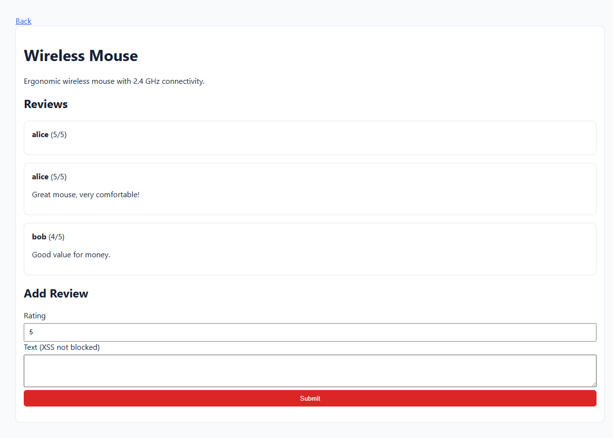
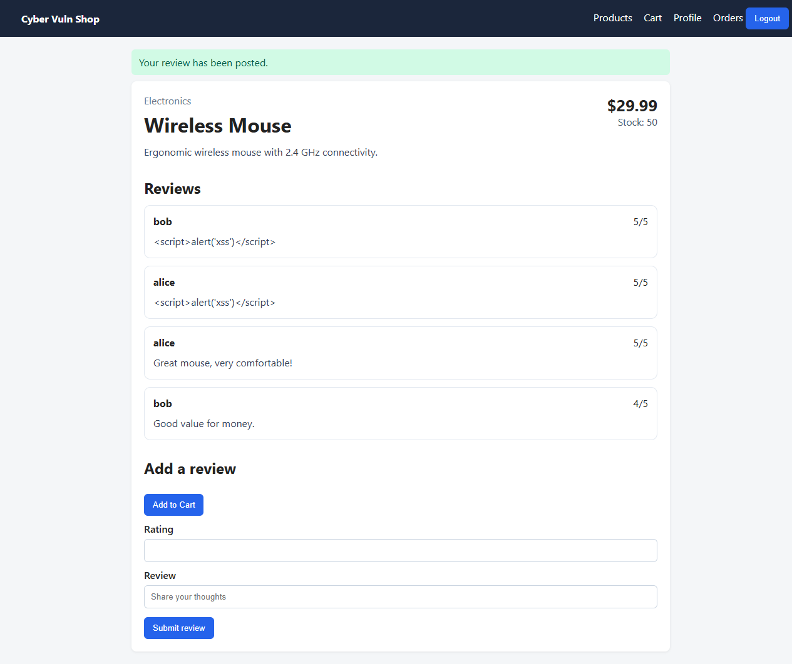

**Endpoint accessed:** `POST http://127.0.0.1:5001/products/1`

### Payload

```html
<script>alert('xss')</script>
```

### Remediation

The production review template renders `{{ review.text }}` without `|safe`, so Jinja's autoescape converts angle brackets to HTML entities. The fixed page therefore displays `&lt;script&gt;alert(&#39;xss&#39;)&lt;/script&gt;` as literal text instead of executing it. The production route also enforces a 1000-character limit and uses CSRF tokens.

---

## Vulnerability 6: IDOR On Order Details

**Severity:** High  
**Category:** Broken Access Control / Missing Authorization  
**OWASP:** A01:2021 Broken Access Control

### Description

The vulnerable order detail route at `/orders/<id>` returns the requested order without checking that the order belongs to the current user. Any logged-in user can therefore enumerate orders by incrementing the numeric ID and read other customers' purchases.

### Steps to Reproduce

Logged in as `alice`, we visited `http://127.0.0.1:5001/orders/1`. The page rendered the order header showing a different `user_id` than `alice`'s id, the line items, the unit prices, and the total. We could repeat this with `/orders/2`, `/orders/3`, and so on to walk the entire order table.

### Impact

The application leaks the entire order history of every customer to any registered account. This violates the privacy promise of the storefront, exposes personally identifiable purchase patterns, and breaks the rubric requirement that "users see what they are supposed to see".

### Evidence

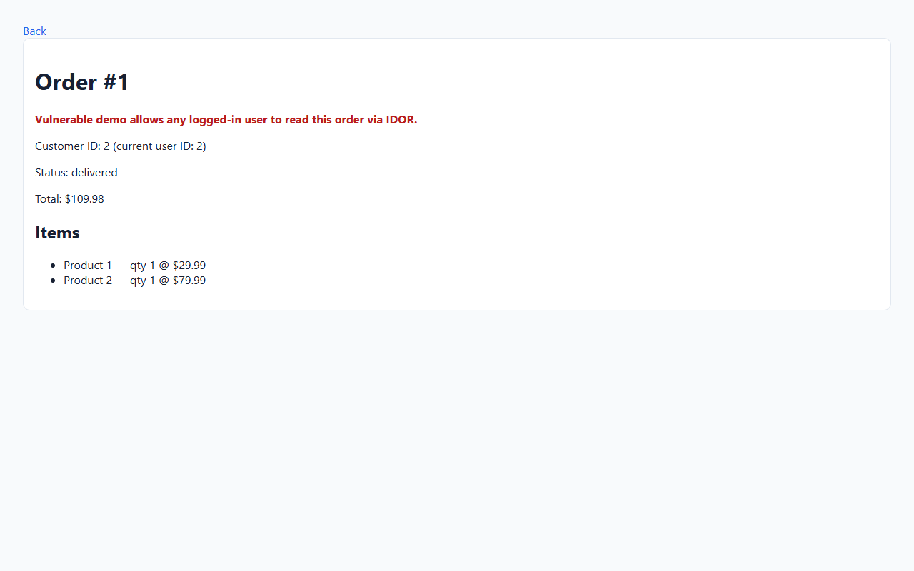

**Endpoint accessed:** `GET http://127.0.0.1:5001/orders/<id>`

### Payload

```
GET /orders/1
GET /orders/2
GET /orders/3
```

### Remediation

The production code does not expose a public `/orders/<id>` endpoint. Order history is reachable only through `routes/profile.py:order_history`, which queries `Order.query.filter_by(user_id=current_user.id)`. Admins use the dedicated `/admin/orders` page that already requires the admin role, and individual orders are not addressable by sequential ID.

---

## Vulnerability 7: Debug Endpoint Leaks Secrets

**Severity:** Critical  
**Category:** Information Disclosure / Security Misconfiguration  
**OWASP:** A05:2021 Security Misconfiguration

### Description

The vulnerable build exposes `/debug` which returns the Flask secret, the JWT secret, the demo LLM API key, the database URI, and selected environment variables. The endpoint requires no authentication and is intended as a "developer convenience".

### Steps to Reproduce

We opened `http://127.0.0.1:5001/debug` in a private browser session with no cookies. The server returned a JSON document containing the `SECRET_KEY`, `EXPOSED_ADMIN_API_KEY`, `LLM_API_KEY`, `JWT_SECRET`, and the SQLite path. None of these values should ever be visible to a non-administrator.

### Impact

With the Flask secret, an attacker can forge session cookies and impersonate any user. With the JWT secret they can sign tokens for any future signed-token feature. With the API keys they can run up bills, leak data through the third-party service, or pivot into the upstream account. This is the kind of disclosure that often turns into a full compromise within hours.

### Evidence

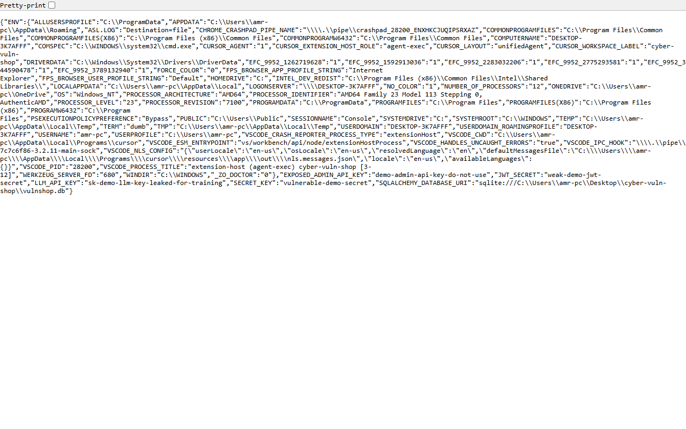

**Endpoint accessed:** `GET http://127.0.0.1:5001/debug`

### Payload

```
GET /debug
```

### Remediation

The production application does not register a `/debug` route. Configuration values are loaded from environment variables in `config.py`, and the only diagnostic endpoint is `/healthz`, which returns the static JSON `{ "status": "ok" }`. The remediation commit also adds a Bandit and pip-audit check in CI to keep stack traces and secrets out of the production code path.

---

## Vulnerability 8: Unauthenticated User Dump With Weak Hashes

**Severity:** Critical  
**Category:** Information Disclosure / Cryptographic Failure  
**OWASP:** A02:2021 Cryptographic Failures

### Description

The vulnerable build exposes `/api/admin/users` without authentication. The response includes every user with their email, role, bcrypt hash, and a parallel MD5 hash that the demo registration process stored alongside the bcrypt hash. MD5 is trivial to crack with rainbow tables.

### Steps to Reproduce

We opened a fresh browser tab with no session and visited `http://127.0.0.1:5001/api/admin/users`. The server replied with a JSON array of users. Each entry included the bcrypt hash and a 32-character MD5 hex string under `weak_password_hash`. Plugging the MD5 hash of a one-character password into any online lookup recovers the original character in milliseconds.

### Impact

The application provides an unauthenticated source of cracked credentials. Any attacker can mirror this endpoint to a credential-stuffing botnet, target other sites where users reuse passwords, or assemble a complete user list for follow-up phishing.

### Evidence

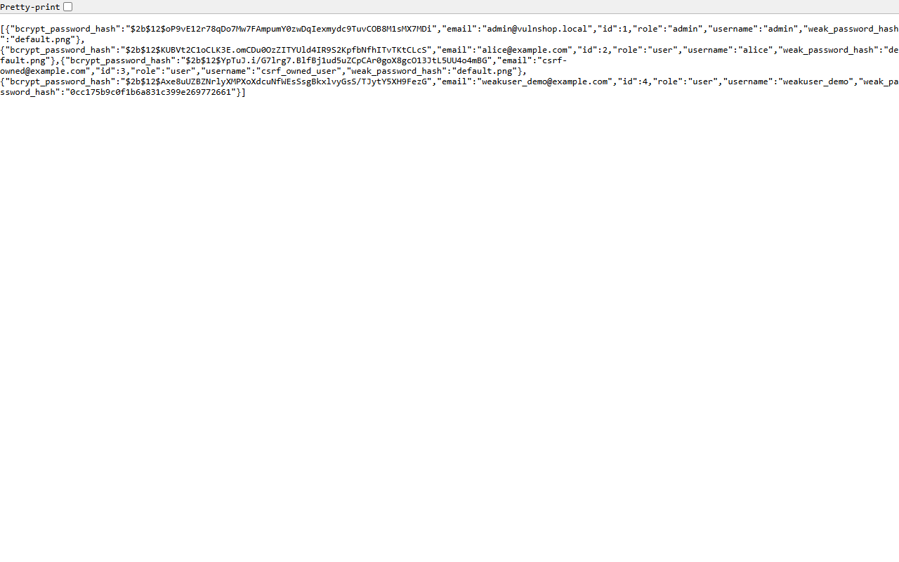

**Endpoint accessed:** `GET http://127.0.0.1:5001/api/admin/users`

### Payload

```
GET /api/admin/users
```

### Remediation

The production code stores only the bcrypt hash in `users.password_hash` and does not maintain a parallel MD5 column. There is no `/api/admin/users` endpoint; user management lives under `/admin/users` protected by the `admin_required` decorator. The remediation also adds tests that verify a non-admin's `GET /admin/users` is redirected away.

---

## Vulnerability 9: Unauthenticated Database Export

**Severity:** Critical  
**Category:** Information Disclosure  
**OWASP:** A01:2021 Broken Access Control

### Description

The vulnerable build exposes `/api/export`. Without any authentication, the endpoint reads every row of every table from the SQLite database and returns it as a JSON document. This includes users, products, orders, order items, and reviews.

### Steps to Reproduce

From a logged-out browser we opened `http://127.0.0.1:5001/api/export`. The server responded with a JSON document whose `users` array contained every account, every email, the bcrypt hashes, and the MD5 hashes; the `orders` array contained every customer's purchase history; the `reviews` array contained every review.

### Impact

A single `GET` request exfiltrates the entire dataset. For an actual production application this is the textbook definition of a data breach and is reportable to regulators. For the demo, it demonstrates how dangerous "operational shortcuts" are.

### Evidence

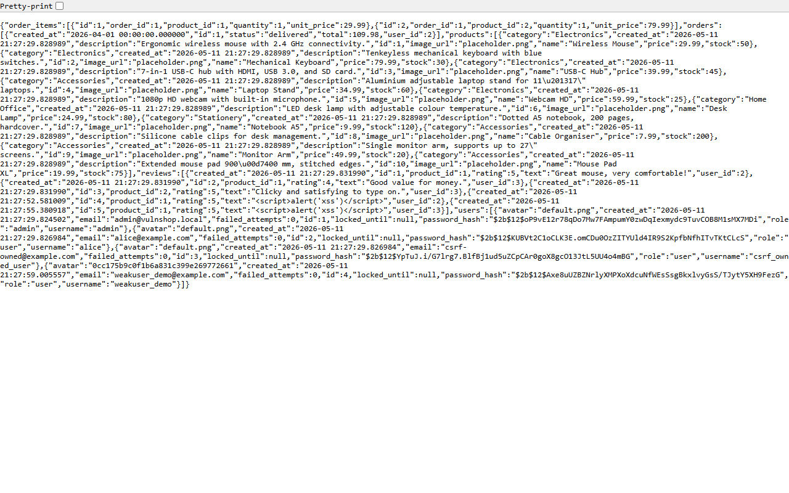

**Endpoint accessed:** `GET http://127.0.0.1:5001/api/export`

### Payload

```
GET /api/export
```

### Remediation

The production application has no equivalent endpoint. Database access is gated behind business-logic routes that scope queries to `current_user`, and admin reads are scoped to admin sessions. The remediation also includes a regression test that fails if a future PR re-introduces an open data export.

---

## Vulnerability 10: Weak Password Accepted

**Severity:** High  
**Category:** Authentication Failure  
**OWASP:** A07:2021 Identification And Authentication Failures

### Description

The vulnerable registration endpoint accepts any password regardless of length or complexity. A single-character password is enough to create a fully usable account. The vulnerable build also has no failed-login lockout, so the same weak passwords can be brute-forced trivially.

### Steps to Reproduce

We opened `http://127.0.0.1:5001/auth/register`, set username `weakuser_demo`, email `weakuser_demo@example.com`, and password `a`. The account was created without any error. We then logged in at `http://127.0.0.1:5001/auth/login` with the same credentials and landed on the products page with a fully authenticated session.

### Impact

Every new account becomes guessable in seconds. Even without the explicit `/api/admin/users` leak, an attacker can run credential-stuffing against `/auth/login` and succeed against any user who registered with a short password.

### Evidence

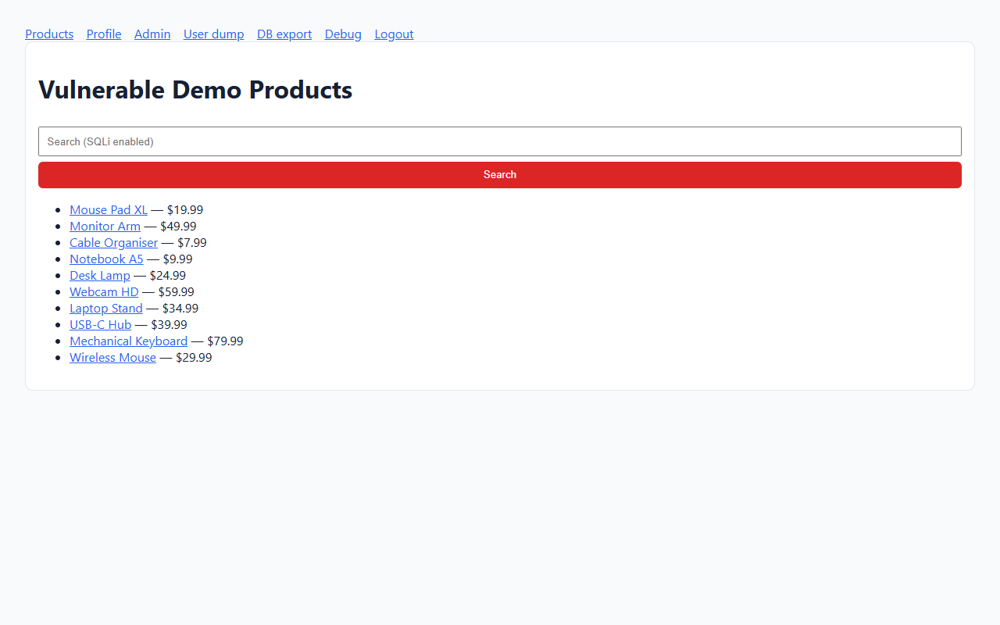
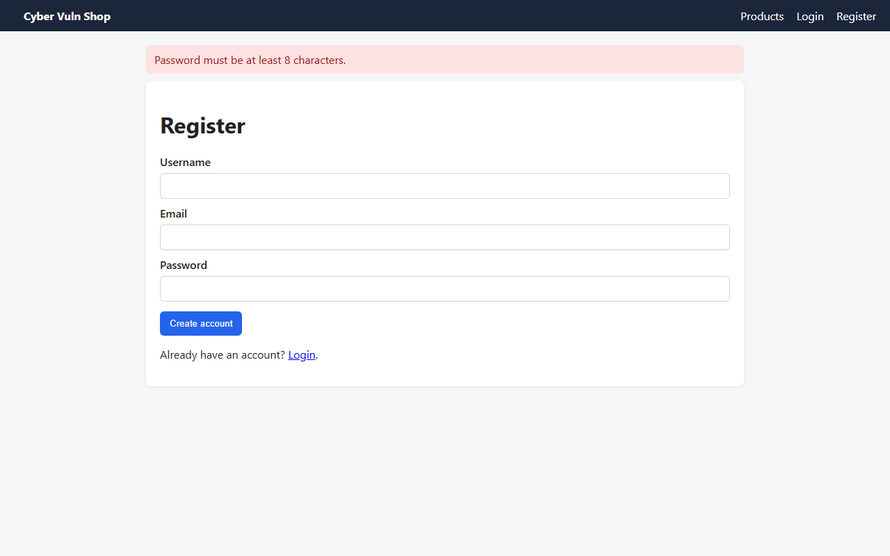

**Endpoint accessed:** `POST http://127.0.0.1:5001/auth/register`

### Payload

```
username=weakuser_demo
email=weakuser_demo@example.com
password=a
```

### Remediation

The production `routes/auth.py:register` validates the username against a strict regex, validates the email format, and enforces `len(password) >= 8`. The production login route also tracks `failed_attempts` and sets `locked_until` for 15 minutes after five failed logins. The smoke test in `scripts/demo_smoke_test.py` proves that the same payload fails on the fixed build.

---

## Summary Table

| ID | Finding | Severity | OWASP | Status |
|----|---------|----------|-------|--------|
| V1 | Broken RBAC on admin pages | High | A01 | Fixed |
| V2 | Missing CSRF protection | High | A01 | Fixed |
| V3 | Open redirect on login `next` | Medium | A01 | Fixed |
| V4 | SQL injection on product search | Critical | A03 | Fixed |
| V5 | Stored XSS in product reviews | High | A03 | Fixed |
| V6 | IDOR on order details | High | A01 | Fixed |
| V7 | Debug endpoint leaks secrets | Critical | A05 | Fixed |
| V8 | Unauthenticated user dump | Critical | A02 | Fixed |
| V9 | Unauthenticated database export | Critical | A01 | Fixed |
| V10 | Weak password accepted | High | A07 | Fixed |

All ten findings are reproducible with `py -3 scripts/demo_smoke_test.py` while the vulnerable build runs on port 5001 and the fixed build runs on port 5000.
