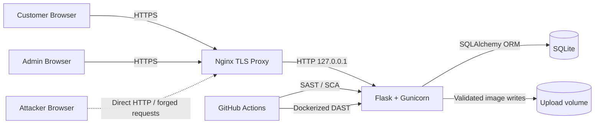

# 3. Threat Model

Cyber Vuln Shop is a Flask e-commerce application with a customer storefront, a separately scoped admin area, and a DevSecOps pipeline. The threat model below uses STRIDE per component and maps every threat to the matching finding in `Exploitation/ExploitationReport.md`.

## 3.1 Data Flow Overview

Trust boundaries:

- Internet to Nginx — TLS terminates here.
- Nginx to Flask — same Docker network, but Flask cannot trust client-supplied `Host` or `X-Forwarded-For` blindly.
- Flask to SQLite — single trust zone, but business logic must enforce row-level ownership.
- Flask to uploads — only validated extensions reach the disk.
- GitHub Actions to app — read-only scanning, but pipeline must not run unreviewed remediation branches with weakened gates.

## 3.2 STRIDE Threats

| ID | Threat Scenario | STRIDE | Affected Part | Impact | Risk | Risk Reasoning |
|----|----------------|--------|---------------|--------|------|----------------|
| T1 | Attacker registers an account with a one-character password and reuses it across other sites | Spoofing | `routes/auth.py:register` | Easy account takeover and credential stuffing | High | The vulnerable build accepts any password length; without a minimum policy, attackers brute-force or guess credentials in seconds. |
| T2 | Attacker fetches a leaked user dump containing MD5 hashes and cracks them offline | Information Disclosure | `demo/vulnerable_app.py:/api/admin/users`, `users.avatar` | Plaintext-equivalent password recovery | Critical | Returning MD5 hashes from an unauthenticated API gives an attacker rainbow-table-ready data for every account. |
| T3 | Authenticated customer browses directly to `/admin` and manages users, products, or orders | Elevation of Privilege | `routes/admin.py:admin_required` | Full administrative control by a regular user | High | The vulnerable build only checks "is logged in"; treating role as optional removes the only barrier to privileged actions. |
| T4 | Logged-in user is tricked into loading a malicious page that POSTs a profile change | Tampering | `routes/profile.py:update_profile` | Account takeover via uncontrolled profile mutation | High | Without CSRF tokens, any cross-site form submission rides on the victim's session cookie and performs state-changing actions. |
| T5 | Attacker uses login form's `next=` to push victims through the trusted login URL to an external phishing site | Spoofing | `routes/auth.py:login` | Phishing and brand-trust loss | Medium | Open redirects let attackers borrow the application's reputation to bypass user suspicion before stealing credentials. |
| T6 | Attacker injects SQL via product search and reads other tables | Tampering | `demo/vulnerable_app.py:/products/` | Data exfiltration including credentials | Critical | The vulnerable search concatenates user input into raw SQL, so a UNION SELECT reveals arbitrary table contents. |
| T7 | Attacker stores `<script>` in a review and steals admin session when admin views the product | Tampering | `demo/vulnerable_app.py:/products/<id>` | Session hijack, defacement, drive-by malware | High | Rendering review text with `|safe` lets stored XSS execute in every viewer's browser, including admins. |
| T8 | User changes `/orders/<id>` in the URL and reads other customers' orders | Tampering / Information Disclosure | `demo/vulnerable_app.py:/orders/<id>` | Privacy breach across customer base | High | Without ownership checks, sequential IDs expose the entire order history of every customer (IDOR). |
| T9 | Attacker calls `/debug` without authentication and downloads secrets | Information Disclosure | `demo/vulnerable_app.py:/debug` | Full takeover by replaying secrets or signing tokens | Critical | A debug endpoint in production leaks API keys, the Flask secret, and the JWT secret, enabling token forgery. |
| T10 | Attacker calls `/api/export` without authentication and downloads the entire SQLite database | Information Disclosure | `demo/vulnerable_app.py:/api/export` | Bulk personal-data exposure | Critical | Returning every row of every table without any auth check is the most direct possible data breach. |
| T11 | Verbose 500 page reveals stack traces and library versions to an attacker | Information Disclosure | `demo/vulnerable_app.py:handle_exception` | Targeted exploitation of known CVEs | Medium | Stack traces expose internal paths, frameworks, and SQL fragments that help an attacker chain other findings. |
| T12 | Attacker repeatedly fails login but is never locked out | Denial of Service / Brute Force | `demo/vulnerable_app.py:login` | Brute force success against weak passwords | Medium | Without lockout or rate limiting, the vulnerable login becomes a credential-stuffing endpoint. |
| T13 | Pipeline ships with default settings and ignores high-severity issues | Tampering | `.github/workflows/devsecops.yml` | Vulnerable code reaches `main` unnoticed | Medium | If quality gates are silenced, the entire DevSecOps story collapses to "we have a workflow file." |
| T14 | TLS private key is committed to git or shared by accident | Information Disclosure | `certs/privkey.pem` | Total HTTPS bypass for the demo deployment | Medium | The self-signed key is generated locally; checking it in or copying it to chat history leaks the TLS identity. |
| T15 | Admin performs destructive product or user changes with no audit trail | Repudiation | `routes/admin.py` | Disputed or undetectable malicious actions | Low | Without per-action logging, the team cannot prove who changed prices or roles after the fact. |

## 3.3 Mapping To Exploitation Findings

| Threat | Finding in `Exploitation/ExploitationReport.md` |
|--------|-------------------------------------------------|
| T1, T12 | Vulnerability 10 — Weak Password Accepted |
| T2 | Vulnerability 8 — Unauthenticated User Dump With Weak Hashes |
| T3 | Vulnerability 1 — Broken RBAC On Admin Pages |
| T4 | Vulnerability 2 — Missing CSRF Protection |
| T5 | Vulnerability 3 — Open Redirect On Login `next` |
| T6 | Vulnerability 4 — SQL Injection On Product Search |
| T7 | Vulnerability 5 — Stored XSS In Product Reviews |
| T8 | Vulnerability 6 — IDOR On Order Details |
| T9 | Vulnerability 7 — Debug Endpoint Leaks Secrets |
| T10 | Vulnerability 9 — Unauthenticated Database Export |
| T11 | Cross-cutting hardening recorded in remediation notes |
| T13, T14, T15 | Operational risks tracked under `reports/remediation-retest.md` residual risks |

## 3.4 Updates After Remediation

Every Critical/High threat in this table maps to a documented remediation in `Exploitation/ExploitationReport.md` and `reports/remediation-retest.md`. The remediated code in the main branch enforces RBAC, CSRF, redirect validation, parameterised queries, output escaping, ownership checks, scoped admin APIs, and a deny-by-default debug stance. The threat model was re-reviewed after the GitHub Actions DevSecOps pipeline passed.
