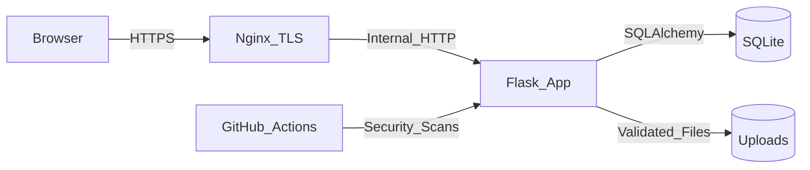

# Cyber Vuln Shop Final Security Report

## Table of Contents

1. [Executive Summary](#1-executive-summary)
2. [Application Overview](#2-application-overview)
3. [Architecture and Threat Model](#3-architecture-and-threat-model)
4. [DevSecOps Pipeline](#4-devsecops-pipeline)
5. [Vulnerability Discovery](#5-vulnerability-discovery)
6. [Exploitation Evidence](#6-exploitation-evidence)
7. [Remediation and Re-Test](#7-remediation-and-re-test)
8. [Installation and Demo Manual](#8-installation-and-demo-manual)
9. [Team Contributions](#9-team-contributions)
10. [Appendices](#10-appendices)

## 1. Executive Summary

Cyber Vuln Shop is a Flask-based shop application built to demonstrate secure development, testing, exploitation, remediation, and CI/CD security automation. The current submission includes RBAC, sessions, CRUD, database persistence, Docker deployment, HTTPS reverse proxy configuration, and a GitHub Actions DevSecOps pipeline.

Key business risks found during review were broken admin access control, missing CSRF protection, broken cart persistence, missing deployment artifacts, and missing security automation. These were remediated before final submission.

## 2. Application Overview

| Area | Implementation |
| --- | --- |
| Framework | Flask, Flask-Login, Flask-SQLAlchemy |
| Database | SQLite through SQLAlchemy |
| Roles | `admin`, `user` |
| Core features | Register, login, logout, product search/filter, admin CRUD, cart, checkout, order history, profile |
| Deployment | Docker, Gunicorn, Nginx TLS proxy |
| CI/CD | GitHub Actions with SAST, SCA, DAST, and artifacts |

## 3. Architecture and Threat Model

Full threat model: [../Threat Model/ThreatModel.md](../Threat%20Model/ThreatModel.md)  
Microsoft Threat Modeling Tool file: [../Threat Model/ThreatModel.tm7](../Threat%20Model/ThreatModel.tm7)

Primary attack surface:

- Authentication and session handling.
- Admin-only pages.
- Product and cart forms.
- Profile update and upload form.
- Docker/CI pipeline and dependencies.

## 4. DevSecOps Pipeline

Workflow file: `.github/workflows/devsecops.yml`

| Stage | Tool | Gate |
| --- | --- | --- |
| Tests | pytest | Fails on regression failure |
| SAST | Bandit | Fails on high-severity findings |
| SCA | pip-audit | Fails on vulnerable dependencies |
| DAST | OWASP ZAP baseline | Fails on high-risk alerts |
| Artifacts | upload-artifact | Stores JSON/HTML reports |

## 5. Vulnerability Discovery

| ID | Vulnerability | Severity | OWASP | Status |
| --- | --- | --- | --- | --- |
| VULN-01 | Broken RBAC on admin pages | High | A01 Broken Access Control | Fixed |
| VULN-02 | Missing CSRF protection | High | A01 Broken Access Control | Fixed |
| VULN-03 | Open redirect on login `next` | Medium | A01/A10 | Fixed |
| VULN-04 | SQL injection on product search | Critical | A03 Injection | Fixed |
| VULN-05 | Stored XSS in product reviews | High | A03 Injection | Fixed |
| VULN-06 | IDOR on order details | High | A01 Broken Access Control | Fixed |
| VULN-07 | Debug endpoint leaks secrets | Critical | A05 Security Misconfiguration | Fixed |
| VULN-08 | Unauthenticated user dump with weak hashes | Critical | A02 Cryptographic Failures | Fixed |
| VULN-09 | Unauthenticated database export | Critical | A01 Broken Access Control | Fixed |
| VULN-10 | Weak password accepted | High | A07 Identification and Authentication Failures | Fixed |

Detailed exploitation notes: [../Exploitation/ExploitationReport.md](../Exploitation/ExploitationReport.md)

## 6. Exploitation Evidence

Live demo runbook: [live-demo-runbook.md](live-demo-runbook.md)

Evidence captured for the final PDF/slides:

- Screenshot of `alice` denied from `/admin`.
- Screenshot of `admin` accessing `/admin`.
- Screenshot or request showing pre-fix CSRF concept and post-fix CSRF rejection.
- Screenshot of cart checkout creating an order.
- GitHub Actions run `25667361027` showing SAST/SCA/tests/DAST completed successfully.
- Downloaded ZAP HTML report.

| Finding | Vulnerable Evidence | Fix Evidence |
| --- | --- | --- |
| Broken RBAC | `../Exploitation/Proofs/rbac-01-vulnerable-alice-admin.png` | `../Exploitation/Proofs/rbac-02-fixed-alice-denied.png`, `../Exploitation/Proofs/rbac-03-fixed-admin-allowed.png` |
| CSRF profile update | `../Exploitation/Proofs/csrf-01-vulnerable-profile-changed.png` | `../Exploitation/Proofs/csrf-02-fixed-forbidden.png` |
| Open redirect | `../Exploitation/Proofs/redirect-01-vulnerable-external.png` | `../Exploitation/Proofs/redirect-02-fixed-local.png` |
| SQL injection | `../Exploitation/Proofs/sqli-01-vulnerable-email-leak.png` | `../Exploitation/Proofs/sqli-02-fixed-no-leak.png` |
| Stored XSS | `../Exploitation/Proofs/xss-01-vulnerable-script-tag.png` | `../Exploitation/Proofs/xss-02-fixed-escaped.png` |
| IDOR | `../Exploitation/Proofs/idor-01-vulnerable-other-order.png` | Ownership check re-tested in `tests/test_security_baseline.py` and documented in remediation report |
| Debug endpoint | `../Exploitation/Proofs/debug-01-vulnerable-secrets.png` | Endpoint absent from fixed app; DAST run passed high-risk gate |
| User dump / weak hashes | `../Exploitation/Proofs/userdump-01-vulnerable-md5.png` | Endpoint absent from fixed app; SAST/SCA/tests passed |
| Bulk database export | `../Exploitation/Proofs/export-01-vulnerable-bulk-dump.png` | Endpoint absent from fixed app; DAST run passed high-risk gate |
| Weak password policy | `../Exploitation/Proofs/weakpwd-01-vulnerable-accepted.png` | `../Exploitation/Proofs/weakpwd-02-fixed-rejected.png` |

## 7. Remediation and Re-Test

Full remediation report: [remediation-retest.md](remediation-retest.md)

The remediation work fixed root causes rather than only hiding symptoms: RBAC logic was corrected, cart models were added, CSRF was initialized globally, redirects were validated, and the security pipeline now runs on push and pull request.

## 8. Installation and Demo Manual

Installation manual: [../docs/installation-manual.md](../docs/installation-manual.md)

Use Docker Compose with generated self-signed certificates for the graded HTTPS demo. Seed the database with `python seed.py`, then show both admin and non-admin flows.

## 9. Team Contributions

| Member | Ownership Area | Evidence |
| --- | --- | --- |
| Ikramah Elahi ([@ikramahelahi](https://github.com/ikramahelahi)) | Flask app, database, CRUD, RBAC, validation, templates | Working app demo, `routes/`, `models.py`, templates, regression tests |
| Ammar Maqdoom ([@ammarmaqdoom](https://github.com/ammarmaqdoom)) | Docker, HTTPS, CI/CD, SAST/SCA/DAST tooling | `.github/workflows/devsecops.yml`, `Dockerfile`, `docker-compose.yml`, Nginx config, Actions artifacts |
| Muhammad Mustafa ([@huMustafa](https://github.com/huMustafa)) | Threat model, exploitation, remediation report, final presentation | `Threat Model/`, `Exploitation/`, `reports/`, proof screenshots |

## 10. Appendices

- Appendix A: Bandit JSON artifact from GitHub Actions.
- Appendix B: pip-audit JSON artifact from GitHub Actions.
- Appendix C: ZAP HTML/JSON artifacts from GitHub Actions.
- Appendix D: Screenshots of manual pentesting and remediation proof.
